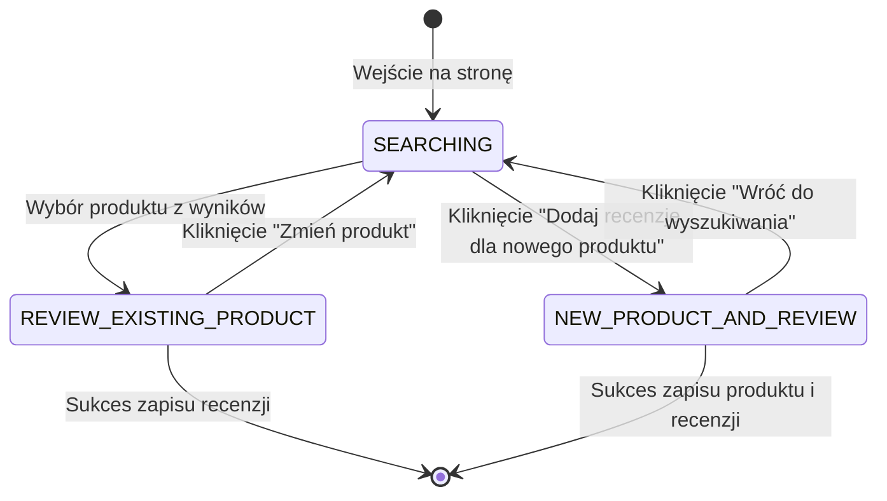

# Strategia Implementacji: Przepływ Dodawania Opinii i Produktu (Decoupled Component Architecture)

Dokument opisuje architekturę, model stanów, podział komponentów na współdzielone i dedykowane, walidację Zod oraz akcje serwerowe dla funkcjonalności dodawania opinii na podstronie `/opinie/dodaj` z uwzględnieniem przyszłego ponownego wykorzystania na stronie produktu.

---

## 1. Wymagania i Założenia Biznesowe

1. **Widok początkowy:** Użytkownik wchodzi na stronę i widzi wyłącznie pole wyszukiwania produktu ([`AsyncSearch`](file:///C:/Users/krzys/mydev/iiwi/components/AsyncSearch.tsx)).
2. **Wyszukiwanie w toku:** Wpisywanie znaków asynchronicznie odpytuje bazę danych o istniejące produkty.
3. **Scenariusz A (`REVIEW_EXISTING_PRODUCT`):**
   - Użytkownik klika jeden z wyników wyszukiwania.
   - Wybrany produkt zostaje podświetlony w widoku podsumowania ([`SelectedProductCard`](file:///C:/Users/krzys/mydev/iiwi/app/opinie/dodaj/_components/SelectedProductCard.tsx)), a pozostałe wyniki wyszukiwania i pole wyszukiwania znikają.
   - Pojawia się formularz dodawania recenzji dla wybranego produktu.
4. **Scenariusz B (`NEW_PRODUCT_AND_REVIEW`):**
   - Użytkownik klika przycisk *"Dodaj recenzję dla nowego produktu"* (dostępny w polu wyszukiwania / widoku pustym).
   - Wyszukiwarka zostaje ukryta.
   - Pojawia się zintegrowany formularz zawierający dane produktu oraz recenzję.
   - Dla użytkownika formularz wygląda jak jedna spójna całość, lecz wewnętrznie składa się z odseparowanych komponentów (`ProductFields` + `ReviewFields`).

---

## 2. Architektura i Organizacja Komponentów (Colocation & Reusability)

Zgodnie z regułami projektu:
- Komponenty **specyficzne wyłącznie dla tej podstrony** znajdują się w `app/opinie/dodaj/_components/`.
- Komponenty **współdzielone**, które będą wykorzystane również na stronie pojedynczego produktu (np. `/produkty/[id]`), trafiają do głównego katalogu `components/reviews/` lub `components/products/`.

### Struktura katalogów i plików

```
components/
├── reviews/                                  # KOMPONENTY WSPÓŁDZIELONE (dla /opinie/dodaj oraz strony produktu)
│   ├── RatingInput.tsx                       # Interaktywny wybór oceny (gwiazdki 1-5)
│   ├── ReviewFields.tsx                      # Odseparowany zestaw pól recenzji (FieldSet)
│   └── ReviewForm.tsx                        # Gotowy, samodzielny formularz recenzji dla znanego produktu (productId)
└── products/                                 # KOMPONENTY WSPÓŁDZIELONE PRODUKTU
    └── ProductFields.tsx                     # Odseparowany zestaw pól produktu (FieldSet)

app/opinie/dodaj/
├── page.tsx                                  # Server Component strony
└── _components/                              # KOMPONENTY DEDYKOWANE WYŁĄCZNIE DLA TEGO PRZEPŁYWU
    ├── AddReviewFlow.tsx                     # Główny orchestrator stanów (SEARCHING, REVIEW_EXISTING_PRODUCT, NEW_PRODUCT_AND_REVIEW)
    ├── SelectedProductCard.tsx               # Karta podświetlająca produkt wybrany z wyszukiwarki z opcją powrotu
    └── CombinedProductReviewForm.tsx         # Zunifikowany formularz scalający ProductFields + ReviewFields
```

---

## 3. Maszyna Stanów Przepływu (Flow State Machine)

Zamiast rozproszonych flag `boolean` stan zarządzany jest unią dyskryminowaną (Discriminated Union):

```typescript
import type { Product } from "@prisma/client";

export type FlowMode =
  | { type: "SEARCHING" }
  | { type: "REVIEW_EXISTING_PRODUCT"; product: Product }
  | { type: "NEW_PRODUCT_AND_REVIEW" };
```



---

## 4. Schematy Walidacji Zod

Zgodnie z konwencją nazewnictwa projektu:
- Wartości schematów: `camelCase` kończące się na `Schema`.
- Typy inferowane: `PascalCase` kończące się na `Input`.
- Pliki umieszczone w `schemas/`.

Już istnieją:
- [`productCreateSchema`](file:///C:/Users/krzys/mydev/iiwi/schemas/product.ts) w [schemas/product.ts](file:///C:/Users/krzys/mydev/iiwi/schemas/product.ts)
- [`reviewCreateSchema`](file:///C:/Users/krzys/mydev/iiwi/schemas/review.ts) w [schemas/review.ts](file:///C:/Users/krzys/mydev/iiwi/schemas/review.ts)

### Nowy schemat łączony: [schemas/productWithReview.ts](file:///C:/Users/krzys/mydev/iiwi/schemas/productWithReview.ts)

```typescript
import { z } from "zod";
import { productCreateSchema } from "@/schemas/product";
import { reviewCreateSchema } from "@/schemas/review";

export const productWithReviewCreateSchema = productCreateSchema.merge(
  reviewCreateSchema.omit({ productId: true })
);

export type ProductWithReviewCreateInput = z.infer<typeof productWithReviewCreateSchema>;
```

---

## 5. Backend i Bezpieczeństwo Danych (Server Actions)

Dla scenariusza `REVIEW_EXISTING_PRODUCT` wykorzystujemy istniejącą akcję:
- [`reviewCreate`](file:///C:/Users/krzys/mydev/iiwi/serverActions/reviewCreate.ts) przyjmującą `{ productId, rate, description }`.

Dla scenariusza `NEW_PRODUCT_AND_REVIEW` konieczna jest **jedna atomowa transakcja** w [serverActions/productWithReviewCreate.ts](file:///C:/Users/krzys/mydev/iiwi/serverActions/productWithReviewCreate.ts), aby wyeliminować błędy częściowe (np. produkt utworzony, ale recenzja odrzucona):

```typescript
"use server";

import { safeActionUserCtx } from "@/lib/actions/safeActionUserCtx";
import { prisma } from "@/lib/db/prisma";
import { productWithReviewCreateSchema } from "@/schemas/productWithReview";

export const productWithReviewCreate = safeActionUserCtx
  .inputSchema(productWithReviewCreateSchema)
  .action(async ({ parsedInput, ctx }) => {
    const { name, productUrl, imageUrl, code, rate, description } = parsedInput;
    const { userId } = ctx;

    return await prisma.$transaction(async (tx) => {
      const product = await tx.product.create({
        data: {
          name,
          productUrl: productUrl || null,
          imageUrl: imageUrl || null,
          code: code || null,
          creatorId: userId,
        },
      });

      const review = await tx.review.create({
        data: {
          productId: product.id,
          rate,
          description,
          userId,
        },
      });

      return { product, review };
    });
  });
```

---

## 6. Implementacja Komponentów Współdzielonych (`components/`)

### 6.1 Wybór oceny: `components/reviews/RatingInput.tsx`

```tsx
"use client";

import { useState } from "react";
import { Star } from "lucide-react";
import { cn } from "@/lib/shadcn/utils";

interface RatingInputProps {
  value?: number;
  onChange?: (value: number) => void;
  disabled?: boolean;
}

export function RatingInput({ value = 5, onChange, disabled = false }: RatingInputProps) {
  const [hovered, setHovered] = useState<number | null>(null);
  const activeRating = hovered ?? value;

  return (
    <div className="flex items-center gap-1" role="radiogroup" aria-label="Ocena w gwiazdkach">
      {[1, 2, 3, 4, 5].map((star) => {
        const isFilled = star <= activeRating;
        return (
          <button
            key={star}
            type="button"
            role="radio"
            aria-checked={star === value}
            aria-label={`${star} z 5 gwiazdek`}
            disabled={disabled}
            onClick={() => onChange?.(star)}
            onMouseEnter={() => setHovered(star)}
            onMouseLeave={() => setHovered(null)}
            className="p-1 text-muted-foreground transition-colors hover:text-amber-500 focus-visible:outline-none focus-visible:ring-2 focus-visible:ring-ring rounded-sm disabled:pointer-events-none"
          >
            <Star
              className={cn(
                "size-6 transition-all",
                isFilled ? "fill-amber-400 text-amber-500" : "text-muted-foreground/40"
              )}
            />
          </button>
        );
      })}
    </div>
  );
}
```

### 6.2 Pola recenzji: `components/reviews/ReviewFields.tsx`

```tsx
"use client";

import { useFormContext, Controller } from "react-hook-form";
import {
  FieldSet,
  FieldLegend,
  FieldGroup,
  Field,
  FieldLabel,
  FieldError,
} from "@/components/ui/field";
import { Textarea } from "@/components/ui/textarea";
import { RatingInput } from "./RatingInput";
import type { ReviewCreateInput } from "@/schemas/review";

interface ReviewFieldsProps {
  className?: string;
  legend?: string;
}

export function ReviewFields({ className, legend = "Twoja opinia" }: ReviewFieldsProps) {
  const {
    register,
    control,
    formState: { errors },
  } = useFormContext<ReviewCreateInput>();

  return (
    <FieldSet className={className}>
      <FieldLegend>{legend}</FieldLegend>
      <FieldGroup>
        <Field>
          <FieldLabel>Ocena *</FieldLabel>
          <Controller
            name="rate"
            control={control}
            render={({ field }) => (
              <RatingInput value={field.value} onChange={field.onChange} />
            )}
          />
          {errors.rate?.message && <FieldError>{errors.rate.message}</FieldError>}
        </Field>

        <Field>
          <FieldLabel htmlFor="review-description">Treść recenzji *</FieldLabel>
          <Textarea
            id="review-description"
            rows={4}
            placeholder="Napisz, jak oceniasz ten produkt..."
            {...register("description")}
          />
          {errors.description?.message && (
            <FieldError>{errors.description.message}</FieldError>
          )}
        </Field>
      </FieldGroup>
    </FieldSet>
  );
}
```

### 6.3 Samodzielny formularz recenzji dla produktu: `components/reviews/ReviewForm.tsx`
*Komponent reużywalny zarówno na `/opinie/dodaj`, jak i bezpośrednio na podstronie danego produktu `/produkty/[id]`.*

```tsx
"use client";

import { useForm, FormProvider } from "react-hook-form";
import { zodResolver } from "@hookform/resolvers/zod";
import { reviewCreateSchema, type ReviewCreateInput } from "@/schemas/review";
import { reviewCreate } from "@/serverActions/reviewCreate";
import { ReviewFields } from "./ReviewFields";
import { Button } from "@/components/ui/button";
import { Spinner } from "@/components/ui/spinner";
import { Alert, AlertDescription } from "@/components/ui/alert";
import { CircleAlert } from "lucide-react";

interface ReviewFormProps {
  productId: string;
  onSuccess?: (reviewId: string) => void;
  onCancel?: () => void;
  className?: string;
}

export function ReviewForm({ productId, onSuccess, onCancel, className }: ReviewFormProps) {
  const methods = useForm<ReviewCreateInput>({
    resolver: zodResolver(reviewCreateSchema),
    mode: "onTouched",
    defaultValues: {
      productId,
      rate: 5,
      description: "",
    },
  });

  const {
    handleSubmit,
    setError,
    clearErrors,
    formState: { errors, isSubmitting },
  } = methods;

  const onSubmit = async (data: ReviewCreateInput) => {
    clearErrors("root");
    const res = await reviewCreate(data);

    if (res?.serverError) {
      setError("root", { message: res.serverError });
      return;
    }

    if (res?.data) {
      onSuccess?.(res.data.id);
    }
  };

  return (
    <FormProvider {...methods}>
      <form onSubmit={handleSubmit(onSubmit)} className={className}>
        {errors.root?.message && (
          <Alert variant="destructive" className="mb-4">
            <CircleAlert className="size-4" />
            <AlertDescription>{errors.root.message}</AlertDescription>
          </Alert>
        )}

        <ReviewFields />

        <div className="flex items-center justify-end gap-3 mt-6">
          {onCancel && (
            <Button
              type="button"
              variant="outline"
              onClick={onCancel}
              disabled={isSubmitting}
            >
              Anuluj
            </Button>
          )}
          <Button type="submit" disabled={isSubmitting}>
            {isSubmitting && <Spinner className="mr-2 size-4" />}
            Opublikuj opinię
          </Button>
        </div>
      </form>
    </FormProvider>
  );
}
```

### 6.4 Pola produktu: `components/products/ProductFields.tsx`

```tsx
"use client";

import { useFormContext } from "react-hook-form";
import {
  FieldSet,
  FieldLegend,
  FieldGroup,
  Field,
  FieldLabel,
  FieldError,
} from "@/components/ui/field";
import { Input } from "@/components/ui/input";
import type { ProductCreateInput } from "@/schemas/product";

interface ProductFieldsProps {
  className?: string;
  legend?: string;
}

export function ProductFields({ className, legend = "Informacje o produkcie" }: ProductFieldsProps) {
  const {
    register,
    formState: { errors },
  } = useFormContext<ProductCreateInput>();

  return (
    <FieldSet className={className}>
      <FieldLegend>{legend}</FieldLegend>
      <FieldGroup>
        <Field>
          <FieldLabel htmlFor="product-name">Nazwa produktu *</FieldLabel>
          <Input
            id="product-name"
            placeholder="np. Logitech MX Master 3S"
            {...register("name")}
          />
          {errors.name?.message && <FieldError>{errors.name.message}</FieldError>}
        </Field>

        <Field>
          <FieldLabel htmlFor="product-url">Adres URL do produktu</FieldLabel>
          <Input
            id="product-url"
            type="url"
            placeholder="https://example.com/produkt"
            {...register("productUrl")}
          />
          {errors.productUrl?.message && (
            <FieldError>{errors.productUrl.message}</FieldError>
          )}
        </Field>

        <Field>
          <FieldLabel htmlFor="product-image">Adres URL zdjęcia</FieldLabel>
          <Input
            id="product-image"
            type="url"
            placeholder="https://example.com/zdjecie.jpg"
            {...register("imageUrl")}
          />
          {errors.imageUrl?.message && (
            <FieldError>{errors.imageUrl.message}</FieldError>
          )}
        </Field>

        <Field>
          <FieldLabel htmlFor="product-code">Kod produktu / EAN</FieldLabel>
          <Input
            id="product-code"
            placeholder="np. 5099206103734"
            {...register("code")}
          />
          {errors.code?.message && <FieldError>{errors.code.message}</FieldError>}
        </Field>
      </FieldGroup>
    </FieldSet>
  );
}
```

---

## 7. Implementacja Komponentów Dedykowanych dla Tej Funkcji (`app/opinie/dodaj/_components/`)

### 7.1 Podświetlona karta wybranego produktu: `SelectedProductCard.tsx`

```tsx
"use client";

import { Card, CardContent } from "@/components/ui/card";
import { Button } from "@/components/ui/button";
import { Badge } from "@/components/ui/badge";
import { Package, RotateCcw } from "lucide-react";
import type { Product } from "@prisma/client";

interface SelectedProductCardProps {
  product: Product;
  onReselect: () => void;
}

export function SelectedProductCard({ product, onReselect }: SelectedProductCardProps) {
  return (
    <Card className="border-primary/40 bg-primary/5 shadow-xs transition-all">
      <CardContent className="p-4 flex items-center justify-between gap-4">
        <div className="flex items-center gap-3 min-w-0">
          <div className="size-10 rounded-md bg-background border flex items-center justify-center shrink-0">
            {product.imageUrl ? (
              // eslint-disable-next-line @next/next/no-img-element
              
            ) : (
              <Package className="size-5 text-muted-foreground" />
            )}
          </div>
          <div className="min-w-0">
            <div className="flex items-center gap-2">
              <span className="font-semibold text-foreground truncate">
                {product.name}
              </span>
              <Badge variant="outline" className="text-xs shrink-0">
                Wybrany produkt
              </Badge>
            </div>
            {product.code && (
              <p className="text-xs text-muted-foreground truncate">
                Kod: {product.code}
              </p>
            )}
          </div>
        </div>

        <Button
          type="button"
          variant="outline"
          size="sm"
          onClick={onReselect}
          className="shrink-0 gap-1.5"
        >
          <RotateCcw className="size-3.5" />
          Zmień produkt
        </Button>
      </CardContent>
    </Card>
  );
}
```

### 7.2 Formularz scalony: `CombinedProductReviewForm.tsx`

```tsx
"use client";

import { useForm, FormProvider } from "react-hook-form";
import { zodResolver } from "@hookform/resolvers/zod";
import {
  productWithReviewCreateSchema,
  type ProductWithReviewCreateInput,
} from "@/schemas/productWithReview";
import { productWithReviewCreate } from "@/serverActions/productWithReviewCreate";
import { ProductFields } from "@/components/products/ProductFields";
import { ReviewFields } from "@/components/reviews/ReviewFields";
import { Card, CardContent, CardHeader, CardTitle, CardDescription } from "@/components/ui/card";
import { Separator } from "@/components/ui/separator";
import { Button } from "@/components/ui/button";
import { Spinner } from "@/components/ui/spinner";
import { Alert, AlertDescription } from "@/components/ui/alert";
import { CircleAlert } from "lucide-react";

interface CombinedProductReviewFormProps {
  onCancel: () => void;
  onSuccess: (productId: string) => void;
}

export function CombinedProductReviewForm({
  onCancel,
  onSuccess,
}: CombinedProductReviewFormProps) {
  const methods = useForm<ProductWithReviewCreateInput>({
    resolver: zodResolver(productWithReviewCreateSchema),
    mode: "onTouched",
    defaultValues: {
      name: "",
      productUrl: "",
      imageUrl: "",
      code: "",
      rate: 5,
      description: "",
    },
  });

  const {
    handleSubmit,
    setError,
    clearErrors,
    formState: { errors, isSubmitting },
  } = methods;

  const onSubmit = async (data: ProductWithReviewCreateInput) => {
    clearErrors("root");
    const res = await productWithReviewCreate(data);

    if (res?.serverError) {
      setError("root", { message: res.serverError });
      return;
    }

    if (res?.data) {
      onSuccess(res.data.product.id);
    }
  };

  return (
    <Card className="border shadow-xs">
      <CardHeader>
        <CardTitle className="text-xl">Dodaj nowy produkt i opinię</CardTitle>
        <CardDescription>
          Podaj dane produktu, a w drugiej części formularza napisz swoją recenzję.
        </CardDescription>
      </CardHeader>

      <CardContent>
        <FormProvider {...methods}>
          <form onSubmit={handleSubmit(onSubmit)} className="space-y-6">
            {errors.root?.message && (
              <Alert variant="destructive">
                <CircleAlert className="size-4" />
                <AlertDescription>{errors.root.message}</AlertDescription>
              </Alert>
            )}

            {/* Sub-form 1: Produkt */}
            <ProductFields />

            <Separator />

            {/* Sub-form 2: Recenzja */}
            <ReviewFields />

            <div className="flex items-center justify-end gap-3 pt-2">
              <Button
                type="button"
                variant="outline"
                onClick={onCancel}
                disabled={isSubmitting}
              >
                Wróć do wyszukiwania
              </Button>
              <Button type="submit" disabled={isSubmitting}>
                {isSubmitting && <Spinner className="mr-2 size-4" />}
                Dodaj produkt i opinię
              </Button>
            </div>
          </form>
        </FormProvider>
      </CardContent>
    </Card>
  );
}
```

### 7.3 Główny Orchestrator: `AddReviewFlow.tsx`

```tsx
"use client";

import { useState } from "react";
import { useRouter } from "next/navigation";
import type { Product } from "@prisma/client";
import { AsyncSearch } from "@/components/AsyncSearch";
import { productSearch } from "@/serverActions/productSearch";
import { ReviewForm } from "@/components/reviews/ReviewForm";
import { SelectedProductCard } from "./SelectedProductCard";
import { CombinedProductReviewForm } from "./CombinedProductReviewForm";
import { Button } from "@/components/ui/button";
import { PlusCircle } from "lucide-react";

export type FlowMode =
  | { type: "SEARCHING" }
  | { type: "REVIEW_EXISTING_PRODUCT"; product: Product }
  | { type: "NEW_PRODUCT_AND_REVIEW" };

export function AddReviewFlow() {
  const router = useRouter();
  const [mode, setMode] = useState<FlowMode>({ type: "SEARCHING" });

  const handleSuccess = (productId: string) => {
    router.push(`/produkty/${productId}`);
  };

  return (
    <div className="space-y-6">
      {/* STAN 1: SEARCHING */}
      {mode.type === "SEARCHING" && (
        <div className="space-y-4">
          <AsyncSearch<Product>
            searchAction={productSearch}
            placeholder="Wpisz nazwę lub kod produktu (min. 3 znaki)..."
            getItemLabel={(p) => p.name}
            onResultSelect={(product) =>
              setMode({ type: "REVIEW_EXISTING_PRODUCT", product })
            }
            emptyState={
              <div className="p-6 border border-dashed rounded-lg text-center space-y-3">
                <p className="text-sm text-muted-foreground">
                  Nie znaleziono takiego produktu w bazie.
                </p>
                <Button
                  variant="outline"
                  size="sm"
                  onClick={() => setMode({ type: "NEW_PRODUCT_AND_REVIEW" })}
                >
                  <PlusCircle className="size-4 mr-2" />
                  Dodaj recenzję dla nowego produktu
                </Button>
              </div>
            }
          />

          <div className="text-center pt-2">
            <Button
              type="button"
              variant="ghost"
              size="sm"
              onClick={() => setMode({ type: "NEW_PRODUCT_AND_REVIEW" })}
              className="text-muted-foreground hover:text-foreground"
            >
              <PlusCircle className="size-4 mr-2" />
              Nie ma Twojego produktu na liście? Dodaj go i napisz recenzję
            </Button>
          </div>
        </div>
      )}

      {/* STAN 2: REVIEW_EXISTING_PRODUCT */}
      {mode.type === "REVIEW_EXISTING_PRODUCT" && (
        <div className="space-y-6">
          <SelectedProductCard
            product={mode.product}
            onReselect={() => setMode({ type: "SEARCHING" })}
          />

          <div className="p-6 border rounded-lg bg-card shadow-xs">
            <h2 className="text-lg font-semibold mb-4">Napisz swoją opinię</h2>
            <ReviewForm
              productId={mode.product.id}
              onSuccess={handleSuccess}
              onCancel={() => setMode({ type: "SEARCHING" })}
            />
          </div>
        </div>
      )}

      {/* STAN 3: NEW_PRODUCT_AND_REVIEW */}
      {mode.type === "NEW_PRODUCT_AND_REVIEW" && (
        <CombinedProductReviewForm
          onCancel={() => setMode({ type: "SEARCHING" })}
          onSuccess={handleSuccess}
        />
      )}
    </div>
  );
}
```

---

## 8. Strona Entry Point: [app/opinie/dodaj/page.tsx](file:///C:/Users/krzys/mydev/iiwi/app/opinie/dodaj/page.tsx)

Zgodnie z regułą o komponentach bez propsów, sygnatura jest czysta (bez pustego interfejsu):

```tsx
import type { Metadata } from "next";
import { AddReviewFlow } from "./_components/AddReviewFlow";

export const metadata: Metadata = {
  title: "Dodaj opinię | TrueReview",
  description: "Dodaj swoją opinię na temat produktu",
};

export function NewReviewPage() {
  return (
    <div className="mx-auto max-w-2xl space-y-6 py-6">
      <div className="flex flex-col gap-2">
        <h1 className="text-3xl font-bold tracking-tight text-foreground">
          Dodaj opinię
        </h1>
        <p className="text-sm text-muted-foreground">
          Wybierz produkt z bazy lub dodaj nowy, aby podzielić się swoją opinią.
        </p>
      </div>

      <AddReviewFlow />
    </div>
  );
}

export default NewReviewPage;
```

---

## 9. Podsumowanie Korzyści Architektonicznych

1. **Pełna izolacja domenowa:** Komponent [`ReviewForm`](file:///C:/Users/krzys/mydev/iiwi/components/reviews/ReviewForm.tsx) może zostać zaimportowany 1:1 na stronie `/produkty/[id]` bez konieczności dotykania logiki `/opinie/dodaj`.
2. **Brak duplikacji logiki walidacji:** Zarówno pojedynczy formularz recenzji, jak i scalony formularz produktu z recenzją, bazują na tych samych schematach Zod i polach formularza.
3. **Czysta struktura Colocation:** W folderze `_components/` podstrony pozostają jedynie elementy dedykowane specyficznemu przepływowi wyszukiwania i przełączania stanów.
4. **Odporność na błędy bazodanowe:** Transakcja `prisma.$transaction` gwarantuje spójność danych przy jednoczesnym tworzeniu produktu i opinii.
