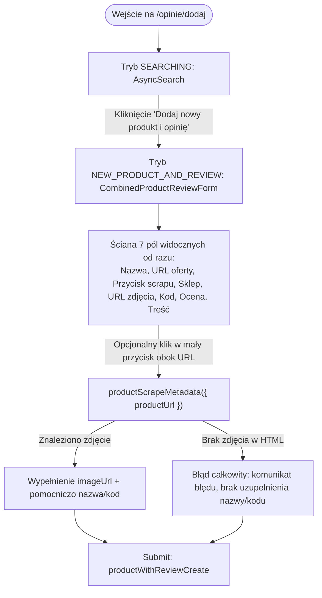

# Plan Przebudowy Przepływu: Dodawanie Nowego Produktu i Opinii

Dokument przedstawia szczegółowy plan dekompozycji i przebudowy ścieżki użytkownika w formularzu **"Dodaj nowy produkt i opinię"** (`/opinie/dodaj`), w tym wdrożenie minimalistycznego ekranu początkowego opartego na 3 elementach, podziału na dwie wyspecjalizowane ścieżki (automatyczną z URL oraz ręczną bez pola URL) oraz ewolucję silnika scrapowania metadanych (rezygnacja z warunku koniecznego posiadania zdjęcia na rzecz sukcesu przy jakichkolwiek pozyskanych danych).

---

## 1. Wstęp i Cele Biznesowo-Użytkowe

### 1.1. Cel Przebudowy
Obecny formularz łączony `CombinedProductReviewForm` prezentuje użytkownikowi natychmiast pełen zestaw wszystkich pól (nazwa, URL produktu, sklep, URL zdjęcia, kod EAN, gwiazdki, recenzja). Taki układ generuje wysoki próg wejścia (cognitive overload), a kluczowa funkcja automatyzacji (scraper danych produktu) jest ukryta jako drugorzędny przycisk obok jednego z wielu pól tekstowych.

Nowy przepływ realizuje zasadę **"Progressive Disclosure"** (stopniowego odkrywania złożoności):
1. **Maksymalne uproszczenie wejścia:** Użytkownik widzi wyłącznie zachętę do podania linku, pole URL i przycisk pobierania, lub alternatywę natychmiastowego dodania ręcznego.
2. **Dwie precyzyjne ścieżki:**
   - **Ścieżka 1 (Automatyczna):** Użytkownik podaje link -> system pobiera maksimum dostępnych danych -> użytkownik weryfikuje pobrane informacje i jedynie dopisuje recenzję. W razie braku danych, formularz otwiera się z zapamiętanym URL (brak konieczności ponownego wklejania).
   - **Ścieżka 2 (Ręczna):** Użytkownik deklaruje brak linku -> system otwiera czysty formularz **bez pola URL**, wymagając jedynie nazwy produktu i recenzji.
3. **Pobieranie Best-Effort:** Algorytm scrapowania nie odrzuca już stron, na których nie udało się znaleźć zdjęcia. Każda uzyskana dana (nazwa, kod, sklep, zdjęcie) stanowi sukces i częściowo uzupełnia formularz, a użytkownik otrzymuje czytelną informację, co zostało pobrane, a co może dopisać sam.

---

## 2. Analiza Stanu Obecnego (As-Is Architecture)

### 2.1. Zestawienie Istniejących Komponentów

```
app/opinie/dodaj/
├── page.tsx                               # Główna strona trasy /opinie/dodaj (Server Component)
└── _components/
    ├── AddReviewFlow.tsx                  # Maszyna stanów (SEARCHING | REVIEW_EXISTING_PRODUCT | NEW_PRODUCT_AND_REVIEW)
    ├── SelectedProductCard.tsx            # Karta wybranego produktu z bazy
    └── CombinedProductReviewForm.tsx      # Monolityczny formularz łączony (produkt + opinia)

components/
├── products/
│   ├── ProductFields.tsx                  # Wszystkie pola produktu + wewnętrzny trigger scrapowania
│   └── ProductShopSelector.tsx            # Autouzupełnianie / wybór sklepu
└── reviews/
    ├── ReviewFields.tsx                   # Pola oceny (gwiazdki) i treści recenzji
    ├── ReviewForm.tsx                     # Formularz recenzji dla istniejącego produktu
    └── RatingInput.tsx                    # Komponent wyboru gwiazdek

serverActions/
├── productScrapeMetadata.ts               # Akcja serwerowa pobierająca metadane (Tier 1 + Tier 2 ZenRows)
└── productWithReviewCreate.ts             # Transakcyjne tworzenie produktu i opinii w Prisma DB

lib/scraper/
├── extractMetadata.ts                     # Parser Cheerio wyciągający og:image, JSON-LD, microdata, selektory DOM
├── ssrfProtection.ts                      # Walidacja bezpieczeństwa adresów URL
└── zenrowsClient.ts                       # Klient API ZenRows (Tier 2 fallback)
```

### 2.2. Obecna Kompozycja i Powiązania

1. [**`app/opinie/dodaj/page.tsx`**](file:///C:/Users/krzys/mydev/iiwi/app/opinie/dodaj/page.tsx):
   - Renderuje nagłówek strony oraz komponent [`AddReviewFlow`](file:///C:/Users/krzys/mydev/iiwi/app/opinie/dodaj/_components/AddReviewFlow.tsx).
2. [**`AddReviewFlow.tsx`**](file:///C:/Users/krzys/mydev/iiwi/app/opinie/dodaj/_components/AddReviewFlow.tsx):
   - Zarządza stanem `mode`:
     - `SEARCHING`: Pole wyszukiwania [`AsyncSearch`](file:///C:/Users/krzys/mydev/iiwi/components/AsyncSearch.tsx) produktów w bazie + przycisk *"Dodaj nowy produkt i opinię w jednym szybkim kroku"*.
     - `REVIEW_EXISTING_PRODUCT`: Podgląd produktu + [`ReviewForm`](file:///C:/Users/krzys/mydev/iiwi/components/reviews/ReviewForm.tsx).
     - `NEW_PRODUCT_AND_REVIEW`: Przełącza na [`CombinedProductReviewForm`](file:///C:/Users/krzys/mydev/iiwi/app/opinie/dodaj/_components/CombinedProductReviewForm.tsx).
3. [**`CombinedProductReviewForm.tsx`**](file:///C:/Users/krzys/mydev/iiwi/app/opinie/dodaj/_components/CombinedProductReviewForm.tsx):
   - Inicjalizuje instancję `useForm<ProductWithReviewCreateInput>`.
   - Renderuje jednocześnie:
     - [`ProductFields`](file:///C:/Users/krzys/mydev/iiwi/components/products/ProductFields.tsx)
     - [`Separator`](file:///C:/Users/krzys/mydev/iiwi/components/ui/separator.tsx)
     - [`ReviewFields`](file:///C:/Users/krzys/mydev/iiwi/components/reviews/ReviewFields.tsx)
     - Przyciski nawigacyjne ("Wróć do wyszukiwania", "Dodaj produkt i opinię").
4. [**`ProductFields.tsx`**](file:///C:/Users/krzys/mydev/iiwi/components/products/ProductFields.tsx):
   - Posiada wewnątrz stan `isPending` (`useTransition`), timer 2.5s dla Tier 2 oraz stan `scrapeNotice`.
   - Pola renderowane naraz: `name`, `productUrl` z przyciskiem *"Wyciągnij zdjęcie produktu"*, `ProductShopSelector`, `imageUrl` z podglądem miniatury, `code`.
5. [**`extractMetadata.ts`**](file:///C:/Users/krzys/mydev/iiwi/lib/scraper/extractMetadata.ts):
   - Linia 407-409:
     ```typescript
     if (!imageUrl) {
       return null;
     }
     ```
     **Rygorystyczny błąd krytyczny:** Jeśli scraper nie odnalazł zdjęcia, cała funkcja zwraca `null`, bezpowrotnie tracąc odnalezioną nazwę produktu czy kod EAN/SKU!
6. [**`productScrapeMetadata.ts`**](file:///C:/Users/krzys/mydev/iiwi/serverActions/productScrapeMetadata.ts):
   - Linia 96 oraz 120 sprawdzają `if (metadata && metadata.imageUrl)`.
   - Jeśli brak zdjęcia, rzuca `returnServerError("Nie udało się automatycznie pobrać zdjęcia...")`.

### 2.3. Diagram Obecnego Przepływu (As-Is)



### 2.4. Zidentyfikowane Problemy
- **Brak wyraźnego podziału ról:** Użytkownik nie wie, czy ma najpierw wkleić link, czy zacząć pisać nazwę.
- **Wymóg zdjęcia jako warunku koniecznego:** Nawet gdy sklep dostarczył idealny tytuł i kod produktu, scraper raportował błąd.
- **Zbędne pole URL w trybie manualnym:** Użytkownik niemający linku do oferty widzi puste pole `productUrl`, co sugeruje, że link może być wymagany lub oczekiwany.
- **Zbyt ciasna integracja w `ProductFields`:** Zarządzanie pobieraniem danych jest zaszyte głęboko w komponencie pól produktu zamiast na poziomie nadrzędnego przepływu.

---

## 3. Projekt Nowego Przepływu (To-Be UX Flow)

Nowy przepływ formularza **"Dodaj nowy produkt i opinię"** eliminuje przeładowanie informacyjne i prowadzi użytkownika krok po kroku:

```mermaid
stateDiagram-v2
    [*] --> UrlPromptStep: Wejście w dodawanie nowego produktu

    state UrlPromptStep {
        [*] --> InitialView
        note right of InitialView
            Widoczne TYLKO 3 elementy:
            1. Nagłówek + podtytuł zachęty
            2. Pole input URL
            3. Przycisk "Pobierz info"
            ---
            Poniżej: "Nie masz linku do oferty?"
            Przycisk: "Dodaj produkt ręcznie"
            Podpis: "wymagamy tylko nazwy"
        end note
    }

    UrlPromptStep --> ScrapingInProgress: Wpisanie URL i klik "Pobierz info"
    UrlPromptStep --> ManualForm: Klik "Dodaj produkt ręcznie"

    state ScrapingInProgress {
        [*] --> Tier1Fetch: Szybki fetch Vercel
        Tier1Fetch --> Tier2ZenRows: Fallback w razie potrzeby (timeout / blokada)
    }

    ScrapingInProgress --> ScrapedFormSuccess: Sukces (znaleziono min. 1 metadaną)
    ScrapingInProgress --> ScrapedFormFailed: Błąd całkowity (0 metadanych / błąd sieci)

    state ScrapedFormSuccess {
        note right of ScrapedFormSuccess
            - Komunikat: co udało się pobrać, a co można uzupełnić
            - Pola uzupełnione znalezionymi danymi
            - Pole productUrl wypełnione
            - Podgląd zdjęcia z opcją zmiany/usunięcia
            - Pola recenzji (ocena + treść)
        end note
    }

    state ScrapedFormFailed {
        note right of ScrapedFormFailed
            - Komunikat o niepowodzeniu scrapingu
            - Pusty formularz do ręcznego uzupełnienia
            - Pole productUrl ZAPAMIĘTANE (wypełnione wpisanym URL)
            - Pola recenzji (ocena + treść)
        end note
    }

    state ManualForm {
        note right of ManualForm
            - Formularz BEZ pola URL produktu
            - Wyróżniona nazwa: "wymagamy tylko nazwy"
            - Opcjonalne pola dodatkowe (sklep, zdjęcie, kod)
            - Pola recenzji (ocena + treść)
        end note
    }

    ScrapedFormSuccess --> Submit: Klik "Dodaj produkt i opinię"
    ScrapedFormFailed --> Submit: Klik "Dodaj produkt i opinię"
    ManualForm --> Submit: Klik "Dodaj produkt i opinię"

    Submit --> [*]: Sukces -> Przekierowanie do /produkty/:id
```

---

## 4. Szczegółowy Opis Kroków Nowego Przepływu

### 4.1. Krok 0: Ekran Początkowy (Tryb `URL_PROMPT`)

Po wejściu w stan dodawania nowego produktu (`NEW_PRODUCT_AND_REVIEW`), użytkownik widzi **wyłącznie minimalistyczną sekcję wprowadzającą**:

1. **Komunikat wiodący:**
   - Duży, czytelny nagłówek: **"Podaj nam link do oferty produktu"**
   - Podtytuł mniejszymi literami (tekst wyciszony, np. `text-sm text-muted-foreground`):
     *"my pobierzemy wszystko co potrzeba, a Ty jedynie ocenisz produkt"*
2. **Pole tekstowe na URL:**
   - Input typu `url` z placeholderem: `https://twoj-sklep.pl/produkt...`
   - Automatyczny autofocus na pole URL.
   - Obsługa zatwierdzenia klawiszem `Enter`.
3. **Przycisk akcji głównej:**
   - Etykieta: **"Pobierz info"** (z ikoną np. `Sparkles` lub `ArrowRight`).
   - Stan `disabled`, dopóki pole URL jest puste lub niepoprawne.
4. **Sekcja alternatywna (poniżej, oddzielona subtelnym separatorem lub tłem):**
   - Etykieta / Pytanie: *"Nie masz linku do oferty?"*
   - Przycisk pomocniczy: **"Dodaj produkt ręcznie"** (wariant `variant="outline"` lub `variant="secondary"`).
   - Informacja uzupełniająca bezpośrednio pod przyciskiem (mały font `text-xs text-muted-foreground`):
     *"wymagamy tylko nazwy"*
5. **Nawigacja wsteczna:**
   - Dyskretny przycisk *"Wróć do wyszukiwania"*, umożliwiający powrót do widoku bazy istniejących produktów.

---

### 4.2. Ścieżka 1: Podał URL (Automatyczne Pobieranie i Weryfikacja)

#### Faza A: Wywołanie i Oczekiwanie
1. Użytkownik klika **"Pobierz info"** (lub wciska Enter).
2. Przycisk przechodzi w stan ładowania (`Spinner`, blokada ponownego kliknięcia).
3. Akcja wywoływana jest przez React 19 `useTransition` (`productScrapeMetadata`).
4. Jeśli czas zapytania przekroczy 2.5s (uruchomienie Tier 2 ZenRows), pojawia się dyskretna informacja:
   *"Zajmie to chwilę dłużej, ale nadal pracuję nad tym..."*.

#### Faza B1: Wynik – Sukces (częściowy lub pełny)
- **Kryterium:** Scraper pozyskał **co najmniej jedną** informację spośród: `name`, `imageUrl`, `code`, `shop`.
- **Prezentacja dla użytkownika:**
  1. Wyświetlany jest elegancki baner statusowy (`ScrapeNoticeBanner`) informujący precyzyjnie o stanie pozyskanych danych, np.:
     - *Gdy pobrano wszystko:* „Pomyślnie pobrano dane produktu ze sklepu. Sprawdź ich poprawność poniżej.”
     - *Gdy pobrano nazwę i sklep, ale brak zdjęcia:* „Pobrano nazwę produktu i rozpoznano sklep. Nie udało się znaleźć zdjęcia – możesz wkleić je ręcznie lub dodać produkt bez zdjęcia.”
     - *Gdy pobrano tylko zdjęcie:* „Pobrano zdjęcie produktu. Uzupełnij nazwę produktu, aby kontynuować.”
  2. Wyświetlany jest formularz edycyjny:
     - Pole `productUrl`: **wypełnione wpisanym adresem** (z możliwością edycji lub ponownego pobrania).
     - Pole `name`: **uzupełnione** (lub puste z autofocusem, jeśli sklep nie udostępnił nazwy).
     - Pole `shopId`: **automatycznie zaznaczony rozpoznany sklep** (`ProductShopSelector`).
     - Pole `imageUrl`: **uzupełnione**, z widocznym podglądem miniatury i przyciskiem *"Usuń"* / *"Zmień"*.
     - Pole `code`: **uzupełnione kodem EAN/SKU**, jeśli został odnaleziony.
     - Sekcja recenzji (`ReviewFields`): ocena (gwiazdki) + treść opinii.
  3. Użytkownik może swobodnie skorygować dowolne pole przed zatwierdzeniem.

#### Faza B2: Wynik – Niepowodzenie (0 danych / błąd sieciowy / błąd SSRF)
- **Kryterium:** Obie warstwy (Tier 1 i Tier 2) zwróciły pusty wynik, kod błędu lub błąd SSRF.
- **Prezentacja dla użytkownika:**
  1. Wyświetlany jest czytelny, nieblokujący baner ostrzegawczy:
     *„Nie udało się automatycznie pobrać danych z podanego linku. Możesz uzupełnić dane ręcznie.”*
  2. Wyświetlany jest pełny formularz do ręcznego uzupełnienia, **ALE z polem `productUrl` już wypełnionym adresem, który użytkownik podał na starcie** (użytkownik nie musi go ponownie kopiować ani wpisywać).
  3. Kursor automatycznie ustawia się w polu `name` (Nazwa produktu).
  4. Sekcja recenzji (`ReviewFields`) jest gotowa do wypełnienia.

---

### 4.3. Ścieżka 2: Kliknięcie Ręcznego Dodawania

1. Użytkownik na ekranie początkowym klika **"Dodaj produkt ręcznie"**.
2. Formularz przełącza się natychmiast w tryb manualny.
3. **Kluczowa cecha widoku:**
   - **Pole `productUrl` jest CAŁKOWICIE UKRYTE** (nie jest renderowane w DOM lub ukryte w UI), ponieważ użytkownik zadeklarował brak linku. W schemacie Zod pole `productUrl` przyjmuje pusty ciąg `""` lub `undefined`.
   - Główny nacisk położony jest na nazwę produktu: widoczna adnotacja *"Wymagamy tylko nazwy produktu, pozostałe pola są opcjonalne"*.
   - Pole `name`: wymagane (min. 3 znaki), z automatycznym autofocusem.
   - Pola opcjonalne (`shopId`, `imageUrl`, `code`) są dostępne dla użytkownika, który chce je uzupełnić samodzielnie (np. wkleić link do zdjęcia ze schowka lub wybrać sklep z listy).
   - Sekcja recenzji (`ReviewFields`): gwiazdki i treść recenzji (wymagane).
4. Przycisk powrotu: *"Chcę jednak podać link do oferty"* (pozwala wrócić do ekranu początkowego).

---

### 4.4. Finał Obu Ścieżek: Zatwierdzenie i Publikacja

1. Niezależnie od ścieżki, użytkownik klika przycisk główny: **"Dodaj produkt i opinię"**.
2. Walidacja Zod (`productWithReviewCreateSchema`):
   - Weryfikacja poprawności nazwy (min. 3 znaki).
   - Weryfikacja oceny (1-5 gwiazdek).
   - Weryfikacja treści recenzji (min. 3 znaki).
   - Weryfikacja opcjonalnych URLi (jeśli podano).
3. Wywołanie Server Action [`productWithReviewCreate`](file:///C:/Users/krzys/mydev/iiwi/serverActions/productWithReviewCreate.ts):
   - W ramach transakcji Prisma tworzy produkt (z przypisaniem opcjonalnego `productUrl`, `imageUrl`, `code`, `shopId`).
   - Tworzy pierwszą recenzję użytkownika i przelicza agregację ocen (`rate_avg`, `rate_count`).
4. Po pomyślnym utworzeniu: przekierowanie za pomocą `router.push("/produkty/[id]")` do strony nowo dodanego produktu.

---

## 5. Modyfikacja Algorytmu Scrapowania Metadanych

Zgodnie z wymaganiem:
> *"algorytm product scrap metadata: rezygnuje z warunku powodzenia (zdjęcie). Od teraz jakakolwiek uzyskana metadata oznacza powodzenie, ale musimy poinformować usera, że tylko określoną daną udało się uzyskać a resztę może podać sam. Więc formularz będzie częściowo uzupełniony tymi danymi które udało się znaleźć."*

### 5.1. Zmiany w Kontrakcie Danych (`ScrapedProductMetadata` & `ScrapedMetadataResult`)

Dotychczas pole `imageUrl` było wymagane:
```typescript
// Dotychczas:
export interface ScrapedProductMetadata {
  imageUrl: string;      // Wymóg bezwzględny
  name?: string | null;
  code?: string | null;
}
```

Nowy kontrakt – wszystkie pola metadanych stają się opcjonalne/nullable:
```typescript
// Nowy kontrakt:
export interface ScrapedProductMetadata {
  imageUrl?: string | null;
  name?: string | null;
  code?: string | null;
}

export interface ScrapedMetadataResult {
  imageUrl?: string | null;
  name?: string | null;
  code?: string | null;
  shop?: MatchedShopResult | null;
  scrapedFields: Array<"name" | "imageUrl" | "code" | "shop">; // Wykaz pobranych danych dla UI
}
```

### 5.2. Zmiany w Parserze HTML ([`lib/scraper/extractMetadata.ts`](file:///C:/Users/krzys/mydev/iiwi/lib/scraper/extractMetadata.ts))

1. **Usunięcie warunku blokującego:**
   Usunąć linie 406–409:
   ```typescript
   // USUNĄĆ:
   if (!imageUrl) {
     return null;
   }
   ```
2. **Kolejność ekstrakcji:**
   Parser najpierw bada wszystkie trzy wymiary:
   - Zdjęcie (`imageUrl`) – z OpenGraph, JSON-LD, Microdata, DOM heurystyki.
   - Nazwę (`name`) – z JSON-LD, `<h1>`, Microdata, OpenGraph, `<title>`.
   - Kod (`code`) – z JSON-LD, Microdata, tabel specyfikacji, wzorców URL.
3. **Nowy warunek zakończenia funkcji:**
   Sukces następuje, gdy znaleziono **co najmniej jedną** wartość:
   ```typescript
   const hasAnyData = Boolean(imageUrl || name || code);
   if (!hasAnyData) {
     return null; // Zwraca null tylko wtedy, gdy żaden element nie został odnaleziony
   }

   return {
     imageUrl: imageUrl || null,
     name: name || null,
     code: code || null,
   };
   ```

### 5.3. Zmiany w Server Action ([`serverActions/productScrapeMetadata.ts`](file:///C:/Users/krzys/mydev/iiwi/serverActions/productScrapeMetadata.ts))

1. **Logika Fallbacku Tier 1 -> Tier 2:**
   - Jeżeli Tier 1 pozyskał **pełne dane** (`imageUrl` oraz `name`), zapytanie kończy się sukcesem natychmiast bez angażowania Tier 2.
   - Jeżeli Tier 1 zwrócił status błędu (403/503/429/timeout) LUB zwrócił HTML, ale **nie odnalazł zdjęcia** (`!metadata?.imageUrl`), system podejmuje próbę w Tier 2 (ZenRows headless browser).
   - **Scalanie wyników (Result Merging):** Jeżeli Tier 2 zwróci dane, łączymy najlepsze wyniki z obu prób (np. nazwa z Tier 1 + zdjęcie wyrenderowane przez JS w Tier 2).
2. **Dopasowanie sklepu:**
   Równolegle lub po zakończeniu pobierania HTML wywoływane jest `findShopByUrl(productUrl)`.
3. **Definicja Sukcesu / Błędu:**
   - Jeżeli pozyskano co najmniej jedno pole spośród `name`, `imageUrl`, `code`, `shop`:
     Akcja zwraca obiekt sukcesu z listą `scrapedFields`.
   - Jeżeli nie pozyskano ŻADNEGO pola (ani ze scrapingu, ani z dopasowania domeny sklepu):
     Akcja zwraca błąd `returnServerError("Nie udało się pobrać informacji o produkcie z podanego linku. Możesz uzupełnić dane ręcznie.")`.

---

## 6. Projekt Architektury Komponentów i Stanu

### 6.1. Dekompozycja Formularza i Struktura Katalogów

Zgodnie z regułą projektu (Next.js Best Practices): komponenty używane wyłącznie na tej trasie umieszczamy w `app/opinie/dodaj/_components/`.

```
app/opinie/dodaj/_components/
├── AddReviewFlow.tsx                  # Nadrzędny koordynator widoków (SEARCHING / EXISTING / NEW)
├── CombinedProductReviewForm.tsx      # Główny kontener nowego przepływu (zarządza useForm i trybami)
├── UrlPromptStep.tsx                  # [NOWY] Minimalistyczny ekran startowy (3 elementy + manual button)
├── ScrapeNoticeBanner.tsx             # [NOWY] Baner informacyjny (co pobrano, czego brakuje, ew. błędy)
└── SelectedProductCard.tsx            # Istniejąca karta podglądu wybranego produktu z bazy

components/products/
├── ProductFields.tsx                  # Zrefaktoryzowane pola produktu (z propsem hideProductUrl)
└── ProductShopSelector.tsx            # Reużywalny selektor sklepu
```

### 6.2. Schemat Stanów w `CombinedProductReviewForm`

`CombinedProductReviewForm` staje się komponentem dwufazowym opartym o stan wewnętrzny `formPhase`:

```typescript
type FormPhase =
  | { type: "URL_PROMPT" }
  | {
      type: "ACTIVE_FORM";
      mode: "scraped_success" | "scraped_fallback" | "manual";
      scrapedFields?: Array<"name" | "imageUrl" | "code" | "shop">;
      scrapeError?: string;
    };
```

1. **Faza `URL_PROMPT`:**
   - Renderuje wyłącznie komponent [`UrlPromptStep`](file:///C:/Users/krzys/mydev/iiwi/app/opinie/dodaj/_components/UrlPromptStep.tsx).
   - Posiada lokalny input URL oraz przycisk *"Pobierz info"*.
   - Posiada przycisk *"Dodaj produkt ręcznie"*.
2. **Faza `ACTIVE_FORM`:**
   - Renderuje formularz `FormProvider`:
     - [`ScrapeNoticeBanner`](file:///C:/Users/krzys/mydev/iiwi/app/opinie/dodaj/_components/ScrapeNoticeBanner.tsx) (jeśli akcja pochodziła ze scrapingu).
     - [`ProductFields`](file:///C:/Users/krzys/mydev/iiwi/components/products/ProductFields.tsx) z właściwością `hideProductUrl={mode === "manual"}`.
     - [`Separator`](file:///C:/Users/krzys/mydev/iiwi/components/ui/separator.tsx).
     - [`ReviewFields`](file:///C:/Users/krzys/mydev/iiwi/components/reviews/ReviewFields.tsx).
     - Przyciski nawigacji dolnej: *"Zmień sposób wprowadzania"* (powrót do promptu) oraz *"Dodaj produkt i opinię"* (submit).

### 6.3. Szczegółowy Projekt Nowych Komponentów

#### Komponent 1: `UrlPromptStep.tsx`
Odpowiada za pierwsze wrażenie użytkownika i zawiera **dokładnie te elementy, o które prosi użytkownik**:

```tsx
interface UrlPromptStepProps {
  onScrape: (url: string) => void;
  onManualSelect: () => void;
  onCancel: () => void;
  isPending: boolean;
  isTier2NoticeVisible: boolean;
}

export function UrlPromptStep({
  onScrape,
  onManualSelect,
  onCancel,
  isPending,
  isTier2NoticeVisible,
}: UrlPromptStepProps) {
  // Uncontrolled lub prosty stan dla URL przed przekazaniem do RHF
  // 1. Nagłówek i podtytuł mnieszymi literami
  // 2. Pole do url
  // 3. Przycisk: "Pobierz info"
  // 4. Sekcja: Label "Nie masz linku do oferty?", Button "Dodaj produkt ręcznie", opis "wymagamy tylko nazwy"
}
```

**Makietowy zarys wizualny:**
```
+-----------------------------------------------------------------+
|                                                                 |
|   Podaj nam link do oferty produktu                             |
|   my pobierzemy wszystko co potrzeba, a Ty jedynie ocenisz      |
|   produkt                                                       |
|                                                                 |
|   [ https://twoj-sklep.pl/oferta/produkt...               ]     |
|   [ Pobierz info (Sparkles)                              ]     |
|                                                                 |
|   -----------------------------------------------------------   |
|                                                                 |
|   Nie masz linku do oferty?                                     |
|   [ Dodaj produkt ręcznie ]                                     |
|   wymagamy tylko nazwy                                          |
|                                                                 |
|                                             [ Wróć do szukania ]|
+-----------------------------------------------------------------+
```

#### Komponent 2: `ScrapeNoticeBanner.tsx`
Informuje użytkownika o statusie scrapowania w sposób przyjazny i wspierający:

```tsx
interface ScrapeNoticeBannerProps {
  mode: "scraped_success" | "scraped_fallback";
  scrapedFields?: Array<"name" | "imageUrl" | "code" | "shop">;
  errorMessage?: string;
}

export function ScrapeNoticeBanner({
  mode,
  scrapedFields = [],
  errorMessage,
}: ScrapeNoticeBannerProps) {
  // Jeśli mode === 'scraped_fallback':
  // Wyświetla Alert informujący, że nie udało się pobrać danych ze wskazanego sklepu,
  // ale link został zapamiętany i można uzupełnić dane ręcznie.

  // Jeśli mode === 'scraped_success':
  // Wyświetla listę plakietek (Badges) lub tekst:
  // "Pobrano: [Nazwa] [Zdjęcie] [Sklep]. Możesz uzupełnić brakujący kod EAN lub zmienić dane."
}
```

#### Komponent 3: Zmiany w `ProductFields.tsx`
- Dodanie propu `hideProductUrl?: boolean`.
  - W trybie ręcznym (`mode === "manual"`) pole `productUrl` nie jest wyświetlane w formularzu.
- Przeniesienie głównego triggera scrapowania do `UrlPromptStep`.
- W formularzu pole `productUrl` pozostaje jako edycyjne z opcjonalnym, mniejszym przyciskiem ponownego odświeżenia/pobrania (lub jako czyste pole tekstowe dla zachowania prostoty).

---

## 7. Weryfikacja Zgodności z Regułami Projektu (Rules Compliance)

| Reguła Projektu | Wymóg | Sposób Realizacji w Nowym Przepływie |
| :--- | :--- | :--- |
| **React Components Props** | Komponenty z props: `interface ComponentNameProps`. Komponenty bez props: **brak pustych interfejsów**, pusta sygnatura `export function Comp()`. | `UrlPromptStepProps`, `ScrapeNoticeBannerProps` ściśle zdefiniowane; komponenty bezstanowe bez pustych interfejsów. |
| **Next.js Colocation** | Komponenty specyficzne dla danej podstrony umieszczać w `_components/`. | `UrlPromptStep.tsx` i `ScrapeNoticeBanner.tsx` trafiają do `app/opinie/dodaj/_components/`. |
| **Zod Naming Conventions** | Stałe schematów: `camelCaseSchema`. Typy inferowane: `PascalCaseInput`. | Wykorzystanie istniejących `productWithReviewCreateSchema` oraz `productScrapeSchema`. |
| **Form & State Management** | React Hook Form + Zod (`useForm` + `zodResolver`). Zakaz `useState` dla wartości pól, loading i błędów serwera. | Brak `useState` dla pól formularza – obsługa przez RHF `setValue` i `register`. Błędy serwerowe przez `setError("root")`. |
| **Async External Actions** | Dla akcji asynchronicznych poza form submission używać React 19 `useTransition`. | Wywołanie `productScrapeMetadata` w `UrlPromptStep` oraz w formularzu obsługiwane przez `useTransition`. |
| **Tailwind CSS v4 Scale** | Używanie dynamicznej skali Tailwind CSS v4 zamiast arbitralnych bracketów (np. `size-16`, `p-6`). | Wszystkie nowe komponenty stylowane czystymi klasami Tailwind utility zgodnymi ze specyfikacją v4. |

---

## 8. Plan Testów i Weryfikacji (Testing Strategy)

### 8.1. Testy Jednostkowe (Unit Tests)

1. [**`tests/unit/extractMetadata.test.ts`**](file:///C:/Users/krzys/mydev/iiwi/tests/unit/extractMetadata.test.ts):
   - **Test 1:** Sukces, gdy strona zawiera wyłącznie `<h1>` (nazwę) i brak jakichkolwiek zdjęć -> funkcja zwraca `{ imageUrl: null, name: "...", code: null }`.
   - **Test 2:** Sukces, gdy strona zawiera wyłącznie zdjęcie OpenGraph i brak tytułu -> funkcja zwraca `{ imageUrl: "...", name: null, code: null }`.
   - **Test 3:** Sukces, gdy strona zawiera tylko kod produktu w tabeli parametrów.
   - **Test 4:** Zwrócenie `null` wyłącznie w przypadku pustego dokumentu lub braku jakichkolwiek metadanych.

### 8.2. Testy Integracyjne (Integration Tests)

1. [**`tests/integration/serverActions/productScrapeMetadata.test.ts`**](file:///C:/Users/krzys/mydev/iiwi/tests/integration/serverActions/productScrapeMetadata.test.ts):
   - **Test 1:** Bezpośredni fetch Tier 1 zwraca wyłącznie nazwę produktu -> akcja zwraca obiekt danych z `name` i `imageUrl: null`, brak błędu serwerowego.
   - **Test 2:** Tier 1 zwraca nazwę bez zdjęcia -> akcja podejmuje próbę Tier 2 (ZenRows) i scala odnalezione zdjęcie z nazwą z Tier 1.
   - **Test 3:** Całkowite niepowodzenie obu warstw -> akcja zwraca kontrolowany `serverError`.
2. [**`tests/integration/products/ProductFields.test.tsx`**](file:///C:/Users/krzys/mydev/iiwi/tests/integration/products/ProductFields.test.tsx) oraz test nowego `CombinedProductReviewForm`:
   - **Test 1:** Ekran startowy renderuje dokładnie 3 elementy główne (nagłówek, pole URL, przycisk) oraz sekcję manualną.
   - **Test 2:** Kliknięcie *"Dodaj produkt ręcznie"* natychmiast ukrywa pole `productUrl` i wyświetla formularz z wymaganą nazwą produktu.
   - **Test 3:** Pomyślne pobranie URL przełącza widok na formularz, wyświetla baner sukcesu oraz wstępnie uzupełnia pola.
   - **Test 4:** Niepomyślne pobranie URL przełącza widok na formularz ręczny, wyświetla komunikat ostrzegawczy i zachowuje wpisany wcześniej adres URL w polu `productUrl`.

### 8.3. Testy End-to-End (E2E Playwright)

1. [**`tests/e2e/product-flow.spec.ts`**](file:///C:/Users/krzys/mydev/iiwi/tests/e2e/product-flow.spec.ts):
   - Dostosowanie scenariusza E2E do nowego przepływu:
     1. Nawigacja do `/opinie/dodaj`.
     2. Kliknięcie dodania nowego produktu.
     3. Weryfikacja widoczności ekranu startowego (3 elementy).
     4. Wybór ścieżki ręcznej lub wpisanie URL.
     5. Wypełnienie recenzji i pomyślna publikacja z weryfikacją przekierowania.

---

## 9. Harmonogram Wdrożenia Krok po Kroku (Implementation Roadmap)

### Faza 1: Ewolucja Silnika Scrapowania Metadanych
- [ ] **Krok 1.1:** Zaktualizować interfejs `ScrapedProductMetadata` w `lib/scraper/extractMetadata.ts` (`imageUrl?: string | null`).
- [ ] **Krok 1.2:** Usunąć warunek krytyczny `if (!imageUrl) return null;` w `extractMetadata.ts`. Zwracać wynik, gdy znaleziono dowolne pole.
- [ ] **Krok 1.3:** Zaktualizować testy jednostkowe w `tests/unit/extractMetadata.test.ts` (testy braku zdjęcia przy obecnej nazwie/kodzie).
- [ ] **Krok 1.4:** Dostosować `serverActions/productScrapeMetadata.ts`:
  - Obsługa sukcesu przy dowolnych danych.
  - Zwracanie tablicy `scrapedFields` dla UI.
  - Opcjonalne scalanie wyników z Tier 1 i Tier 2.
- [ ] **Krok 1.5:** Zaktualizować testy integracyjne w `tests/integration/serverActions/productScrapeMetadata.test.ts`.

### Faza 2: Utworzenie Nowych Komponentów UI
- [ ] **Krok 2.1:** Utworzyć `app/opinie/dodaj/_components/UrlPromptStep.tsx` z 3 elementami głównymi + blokiem ręcznym.
- [ ] **Krok 2.2:** Utworzyć `app/opinie/dodaj/_components/ScrapeNoticeBanner.tsx` z obsługą komunikatów o pobranych polach i brakach.
- [ ] **Krok 2.3:** Zaktualizować `components/products/ProductFields.tsx` o prop `hideProductUrl?: boolean`.

### Faza 3: Przebudowa Formularza Głównego i Nawigacji
- [ ] **Krok 3.1:** Przebudować `app/opinie/dodaj/_components/CombinedProductReviewForm.tsx`:
  - Wprowadzić maszynę stanów faz formularza (`URL_PROMPT` vs `ACTIVE_FORM`).
  - Podpiąć obsługę `onScrape` z `useTransition` i timerem Tier 2.
  - Zaimplementować ścieżkę 1A (sukces częściowy/pełny) i 1B (niepowodzenie z zachowaniem URL).
  - Zaimplementować ścieżkę 2 (manualna, ukryte pole URL).
- [ ] **Krok 3.2:** Dostosować etykiety i nawigację powrotną w `AddReviewFlow.tsx`.

### Faza 4: Weryfikacja, Testy i Szlify
- [ ] **Krok 4.1:** Uruchomić i zaktualizować testy jednostkowe i integracyjne (`npm run test`).
- [ ] **Krok 4.2:** Zaktualizować testy E2E w `tests/e2e/product-flow.spec.ts`.
- [ ] **Krok 4.3:** Przeprowadzić weryfikację typów (`npm run typecheck`) oraz lintera (`npm run lint`).
