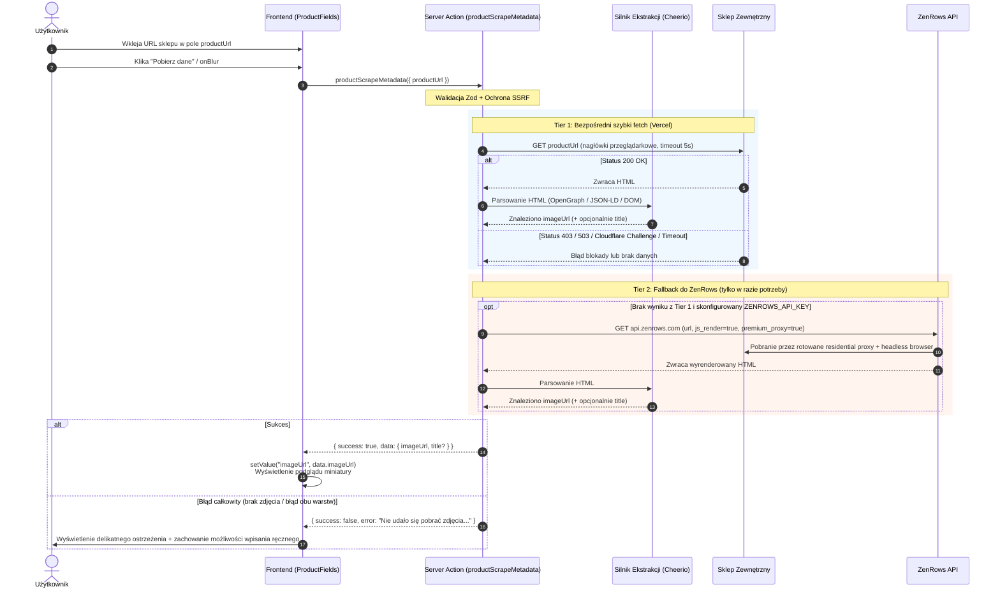

# Plan Implementacji: Scraper URL Zdjęcia Produktu

Dokument opisuje plan wdrożenia funkcjonalności automatycznego pobierania adresu URL głównego zdjęcia produktu na podstawie linku do sklepu internetowego wprowadzonego przez użytkownika. Rozwiązanie jest zoptymalizowane pod kątem infrastruktury serverless na platformie **Vercel** z wykorzystaniem hybrydowej architektury: **szybki natywny `fetch()` na własnym serwerze + zewnętrzny fallback do ZenRows API**.

---

## 1. Założenia Główne i Cel Biznesowy

- **Lokalizacja w aplikacji:** Formularz dodawania produktu i opinii (`/opinie/dodaj` -> `CombinedProductReviewForm` -> `ProductFields`).
- **Doświadczenie użytkownika (UX):**
  1. Użytkownik wkleja link do sklepu (np. `https://www.action.com/pl-pl/p/3222380/ladowarka-scienna-usb-c-sologic/`).
  2. Klika przycisk pobierania - "Wyciągnij zdjęcie produktu"
  3. Pojawia się wskaźnik ładowania (spinner).
  4. Scraper pobiera stronę, wyciąga URL głównego zdjęcia oraz opcjonalnie sugeruje nazwę produktu oraz kod produktu.
  5. URL zostaje automatycznie wpisany do pola `imageUrl`, a w formularzu wyświetla się podgląd miniatury z możliwością usunięcia lub zmiany.
  6. W przypadku konieczności uruchomienia Tier 2, zmienia komunikat dla użytkownika "Zajmie to chwilę dłużej, ale nadal pracuję nad tym..."
  7. W przypadku blokady strony lub błędu, formularz wyświetla czytelny, nieblokujący komunikat i pozwala na ręczne wklejenie linku.
  8. W przypadku wklejenia niebezpiecznego linku do sklepu, czytelna informacja w przyczynie nie podjęcia próby pobrania url zdjęcia.
  9. Po wysłaniu formularza, URL zdjęcia jest zapisywany w bazie danych w tabeli `Product`.
- **Infrastruktura:** Vercel Serverless Functions (Next.js 16).
- **Zarządzanie kosztami (Zero-Cost / Low-Cost Strategy):**
  - **Tier 1 (Darmowy backend Vercel):** Bezpośredni `fetch()` (trwa ~150-300 ms, koszt: 0 zł / 0 kredytów). Obsługuje ~70-80% standardowych sklepów (Shopify, WooCommerce, Allegro, Morele itp.).
  - **Tier 2 (Fallback ZenRows API):** Wywoływany **wyłącznie** wtedy, gdy Tier 1 napotka błąd blokady (np. status 403/503 Cloudflare, jak na Action.com lub MediaExpert) lub nie zwróci danych. Pozwala zmieścić się w darmowym comiesięcznym pakiecie **5 000 kredytów ZenRows** (co daje ~200 trudnych sklepów/miesiąc za darmo na stałe).

---

## 2. Architektura Rozwiązania

### 2.1. Diagram Przepływu Danych

---

## 3. Hierarchia Ekstrakcji Danych (Heurystyka Pobierania Głównego Zdjęcia)

Gdy silnik otrzyma kod HTML (z Tier 1 lub Tier 2), następuje analiza dokumentu za pomocą lekkiej biblioteki `cheerio` według precyzyjnej hierarchii priorytetów:

1. **Priorytet 1: Meta tagi Open Graph oraz Twitter Card**
   - `meta[property="og:image"]` (oraz `og:image:secure_url`)
   - `meta[name="twitter:image"]` / `meta[property="twitter:image"]`
   - *Uzasadnienie:* Najbardziej niezawodne źródło — sklepy internetowe niemal zawsze definiują w Open Graph reprezentatywne zdjęcie produktu dla celów udostępniania w social media.

2. **Priorytet 2: Dane strukturalne Schema.org (JSON-LD)**
   - Wyszukanie skryptów `<script type="application/ld+json">`.
   - Weryfikacja węzłów o typie `@type: "Product"`.
   - Odczyt pola `image` (obsługa formatów: string, tablica stringów `images[0]`, obiekt `ImageObject` z polem `url` lub `contentUrl`).
   - *Uzasadnienie:* Standard Google Rich Snippets / Google Shopping — zazwyczaj wskazuje bezpośrednie zdjęcie produktu w pełnej rozdzielczości.

3. **Priorytet 3: Mikrodane HTML5**
   - Atrybut `[itemprop="image"]` (na elementach ``, `<meta>` lub `<a>`).

4. **Priorytet 4: Heurystyka DOM (Selektory e-commerce)**
   - Wyszukanie w kontenerach typowych dla sklepów:
     - `[data-testid*="product-image"] img`
     - `[data-gallery] img`
     - `.product-image img`, `.product-gallery img`, `.product__media img`
     - `main picture img`
   - Filtracja: odrzucanie małych ikonek, plików `.svg`, trackerów 1x1 px, grafik zawierających w nazwie `logo`, `banner`, `icon`, `spinner`.

5. **Normalizacja i Walidacja Adresu URL:**
   - Rozwijanie linków względnych do bezwzględnych: `new URL(src, baseUrl).href`.
   - Obsługa adresów protocol-relative: zamiana `//cdn.sklep.pl/...` na `https://cdn.sklep.pl/...`.
   - Walidacja protokołu (`http://` lub `https://`).

---

## 4. Bezpieczeństwo i Dobre Praktyki (Must-Have)

### 4.1. Ochrona przed SSRF (Server-Side Request Forgery)
Ponieważ serwer wykonuje zapytanie HTTP pod adres podany przez użytkownika, niezbędna jest rygorystyczna ochrona:
- **Walidacja schematu adresu:** Dozwolone wyłącznie protokoły `http:` oraz `https:`.
- **Blokada adresów prywatnych i pętli zwrotnej (Loopback):**
  - Blokada `localhost`, `127.0.0.1`, `0.0.0.0`, `::1`.
  - Blokada chmurowych adresów metadanych (np. AWS/GCP metadata: `169.254.169.254`, `metadata.google.internal`).
  - Blokada prywatnych podsieci IPv4: `10.0.0.0/8`, `172.16.0.0/12`, `192.168.0.0/16`.
- **Weryfikacja nazwy hosta:** Odrzucanie domen bez kropki lub ze znakami specjalnymi.

### 4.2. Ścisłe Timeouty (AbortController)
- **Tier 1 (Direct fetch):** Maksymalnie **5 000 ms** (5 sekund).
- **Tier 2 (ZenRows API):** Maksymalnie **8 000 ms** (8 sekund).
- Zapobiega to blokowaniu wątków i przekraczaniu limitów czasu funkcji Vercel.

### 4.3. Autoryzacja i Ochrona Zasobów
- Użycie istniejącego w projekcie klienta `safeActionUserCtx`.
- Akcja pobierania metadanych dostępna **wyłącznie dla zalogowanych użytkowników**.
- Eliminuje to ryzyko wykorzystania aplikacji jako otwartego proxy przez boty z zewnątrz.

### 4.4. Tolerancja Błędów i Manualny Fallback
- Scraper jest funkcją asynchroniczną i **pomocniczą**.
- W przypadku jakiegokolwiek niepowodzenia formularz nie rzuca błędu blokującego dodanie produktu.
- Użytkownik zachowuje pełną swobodę ręcznego wpisania/wklejenia linku do zdjęcia w pole `imageUrl`.

---

## 5. Wpływ na Istniejącą Bazę Danych

- **Brak konieczności migracji:** 
  - Model `Product` w `prisma/schema.prisma` posiada już dedykowane pola:
    - `productUrl String? @map("product_url")`
    - `imageUrl String? @map("image_url")`
- **Gotowa logika zapisu:** 
  - Akcja serwerowa `productWithReviewCreate` (`serverActions/productWithReviewCreate.ts`) przyjmuje już pole `imageUrl` i zapisuje je w transakcji bazy danych.
- **Bezpieczeństwo integralności:** 
  - W bazie przechowywany jest finalnie zwykły ciąg znaków URL (tekstowy link do zasobu CDN sklepu), co nie generuje obciążenia przestrzeni dyskowej bazy danych.

---

## 6. Projekt Zmian w Kodzie

### 6.1. Nowe Pliki do Utworzenia

1. **`schemas/productScrape.ts`**
   - Zod schema walidująca parametry wejściowe akcji scrapingowej (`productScrapeSchema`, typ `ProductScrapeInput`).
   - Standard nazewnictwa zgodny z regułami projektu: `camelCaseSchema` i `PascalCaseInput`.

2. **`lib/scraper/ssrfProtection.ts`**
   - Funkcja `validateUrlSafety(inputUrl: string): { isValid: boolean; error?: string }` chroniąca przed atakami SSRF i zapytaniami do sieci wewnętrznej.

3. **`lib/scraper/extractMetadata.ts`**
   - Moduł parsujący HTML za pomocą `cheerio`.
   - Implementacja priorytetów: OpenGraph -> JSON-LD -> Microdata -> DOM.
   - Normalizacja linków względnych.

4. **`lib/scraper/zenrowsClient.ts`**
   - Funkcja pomocnicza komunikująca się z API ZenRows z parametrami `js_render=true` oraz `premium_proxy=true`.

5. **`serverActions/productScrapeMetadata.ts`**
   - Akcja serwerowa Next.js oparta o `safeActionUserCtx`.
   - Orkiestracja hybrydowa:
     1. Walidacja SSRF.
     2. Próba pobrania bezpośredniego przez `fetch()` z nagłówkami imitującymi przeglądarkę.
     3. W razie błędu 403/503 lub braku zdjęcia: próba przez ZenRows.
     4. Zwrot obiektu `{ imageUrl: string | null; title?: string | null }`.

### 6.2. Pliki do Modyfikacji

1. **`package.json`**
   - Dodanie zależności `cheerio` (lekki, szybki parser DOM dla środowisk serwerowych Node.js/Vercel).
2. **`components/products/ProductFields.tsx`**
   - Dodanie przycisku pobierania danych z URL (ikona `Sparkles` lub `Download` z lucide-react) obok pola `productUrl`.
   - Obsługa stanu ładowania z użyciem React 19 `useTransition` (zgodnie z regułami projektu dotyczącymi async triggers).
   - Wyświetlenie eleganckiego komponentu podglądu miniatury pobranego zdjęcia pod polem `imageUrl` z możliwością usunięcia / wyczyszczenia.
   - Opcjonalne automatyczne uzupełnienie pola `name` (nazwa produktu), jeżeli pole było dotychczas puste, a scraper wyciągnął tytuł strony.
3. **`.env.example`**
   - Dodanie zmiennej `ZENROWS_API_KEY=""`.

---

## 7. Szczegółowy Harmonogram Wdrożenia

### Krok 1: Instalacja Zależności i Konfiguracja Środowiska
- [ ] Zainstalować `cheerio` za pomocą menedżera pakietów (`npm install cheerio`).
- [ ] Zaktualizować `.env.example` o opcjonalny klucz `ZENROWS_API_KEY`.

### Krok 2: Warstwa Bezpieczeństwa i Walidacji
- [ ] Utworzyć `schemas/productScrape.ts` z definicją `productScrapeSchema` (walidacja formatu URL, brak spacji, dozwolony protokół http/https).
- [ ] Zaimplementować `lib/scraper/ssrfProtection.ts` (blokada localhost, IP prywatnych, metadanych chmurowych).

### Krok 3: Silnik Ekstrakcji Danych (HTML Parser)
- [ ] Zaimplementować `lib/scraper/extractMetadata.ts`:
  - Ekstrakcja tagów Open Graph / Twitter Cards.
  - Bezpieczny parser JSON-LD (`@type: Product`).
  - Heurystyka selektorów DOM jako fallback.
  - Normalizacja URLi do formatu bezwzględnego.

### Krok 4: Integracja Hybrydowego Pobierania (Server Action)
- [ ] Zaimplementować klienta ZenRows w `lib/scraper/zenrowsClient.ts`.
- [ ] Utworzyć akcję serwerową `serverActions/productScrapeMetadata.ts`:
  - Tier 1: Szybki natywny `fetch` z nagłówkami przeglądarkowymi i timeoutem 5s.
  - Tier 2: Wywołanie ZenRows w razie błędu blokady (403/503) lub braku danych.
  - Zwracanie spójnego obiektu wyniku lub kontrolowanego błędu.

### Krok 5: Integracja z Formularzem UI (`ProductFields.tsx`)
- [ ] Zintegrować przycisk pobierania przy polu `productUrl`.
- [ ] Dodać obsługę `useTransition` dla asynchronicznego wywołania akcji pobierania.
- [ ] Dodać komponent podglądu zdjęcia:
  - Miniatura obrazu z obsługą błędów ładowania (`onError`).
  - Przycisk usunięcia / zmiany grafiki.
- [ ] Podpiąć `setValue("imageUrl", data.imageUrl, { shouldValidate: true })` z `react-hook-form`.
- [ ] Opcjonalnie: uzupełnienie `name`, jeśli pole jest puste.

### Krok 6: Weryfikacja i Testy
- [ ] Test jednostkowy modułu SSRF (próby podania `http://localhost`, `127.0.0.1`, `169.254.169.254`).
- [ ] Test jednostkowy modułu ekstrakcji HTML na przykładowych próbkach (OpenGraph, JSON-LD, czysty DOM).
- [ ] Test integracyjny akcji serwerowej na różnych sklepach (sklep z bezpośrednim dostępem vs sklep z Cloudflare jak Action.com).
- [ ] Weryfikacja typów TypeScript (`npm run typecheck`) oraz lintera (`npm run lint`).

---

## 8. Podsumowanie Korzyści Wybranej Strategii

1. **Zero problemów z Vercel:** Brak ciężkich binarek Chromium i Playwrighta na Vercelu eliminuje ryzyko przekroczenia limitu rozmiaru paczki (50 MB) oraz błędów braku pamięci RAM (OOM).
2. **Skuteczność 99%:** Trudne sklepy chronione przez Cloudflare Turnstile/Bot Management (np. Action.com) są bezbłędnie obsługiwane przez dedykowane proxy ZenRows.
3. **Maksymalna optymalizacja kosztów:** Zwykłe sklepy scrapowane są bezpłatnie w kilkaset milisekund, a płatne/darmowe limity ZenRows są oszczędzane wyłącznie na trudne przypadki.
4. **Czysta architektura:** Rozwiązanie jest w pełni zgodne z przyjętymi w projekcie standardami React 19, Zod, React Hook Form oraz Next-Safe-Action.
